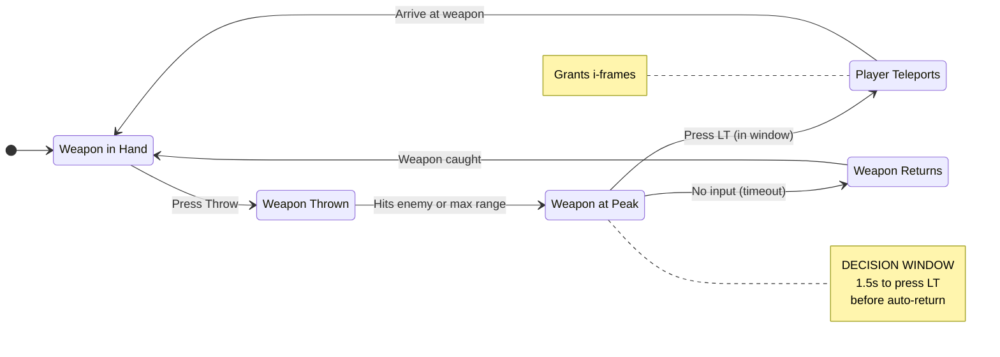
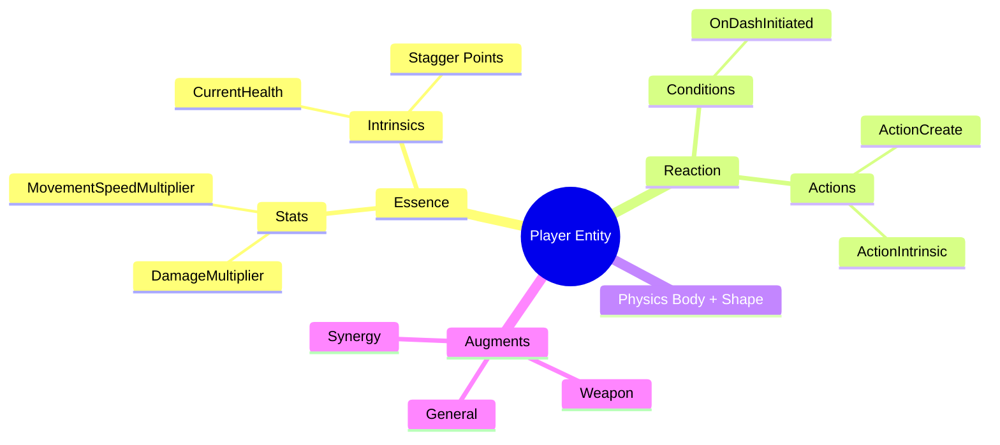

# unity-mechanic-diagrams — draw the mechanic so a non-programmer gets it

A designer says "I need to explain this combo's timing to an artist" or "map how
this whole system fits together." Your job is the **picture**: turn a mechanic,
combo, or system into ONE Mermaid diagram a non-programmer reads instantly. You
do NOT build the mechanic — `unity-designer-vocabulary` translates the request,
`unity-augment-architecture` composes the chain, the `unity-track-*` specialists
author clips, and `unity-track-player-inputs` owns input/combo timing. You draw
what they describe.

**Only three diagram types are allowed: `gantt`, `stateDiagram-v2`, `mindmap`.**
Never reach for flowchart, sequence, class, ER, etc. — if the mechanic doesn't
fit one of the three, you've picked the wrong frame; re-read the request.

**Portability:** the Arvex *vocabulary* (Essence, Reaction, Augments, the three
chains) is stable, but every mechanic name, frame count, stat, and event below is
a **worked example from vex-ee**. Diagram THE READER'S mechanic — rediscover its
real event keys, durations, and ObjectDefinition names via `unity-cli`; don't
copy these labels.

## Which of the three — decide first

| The designer wants to show… | Use | Because |
|---|---|---|
| Attack **timing** — startup/active/recovery frames, when a VFX fires, an input-buffer / cancel window, how two tracks overlap on a Timeline | **Gantt** | it's a time axis with parallel lanes |
| **Branching logic over time** — a combo tree (LMB vs RMB), enemy AI, a status loop (Burning→Climax→Stagger), "press LT at the peak or it auto-returns" | **stateDiagram-v2** | it's states + transitions + decisions |
| **Structure, no time** — an ECS entity's components, the Essence/Reaction/Augment hierarchy, which synergy augments group together, the input pipeline | **mindmap** | it's a containment tree |

Rule of thumb: *"when does it happen?"* → Gantt. *"what happens next / which
branch?"* → stateDiagram. *"what is it made of?"* → mindmap.

## Mapping Arvex vocabulary onto nodes

Whichever type, label nodes in the project's own words so the wiring is legible:

- **Essence (numbers)** → **Stats** (scaling, ×100 fixed-point: `DamageMultiplier`,
  `MovementSpeedMultiplier`, `SlowMo`) and **Intrinsics** (live counters:
  `CurrentHealth`, `Stagger Points`, a dash counter). A mindmap groups them under
  the entity; a stateDiagram uses an Intrinsic crossing a threshold as a
  transition; a Gantt rarely shows numbers (it shows *time*).
- **Reaction (logic)** → `ReactionAuthoring` / `TargetsAuthoring` /
  `ConditionEventObject`. The "IF conditions THEN action" node is the hinge of a
  stateDiagram: a transition label is usually the **event** or **condition**
  (`OnDashInitiated == 1`, `Stagger Points >= 5`).
- **Augments** → Weapon (LMB/RMB/Misc), Synergy (combinations), General. Group
  these in a mindmap; show a combo's LMB-vs-RMB fork in a stateDiagram.
- **The three chains** (own a mechanic's shape — see `unity-augment-architecture`):
  - **Trigger-Spawn** → a stateDiagram whose transitions are *contact Enter →
    instantiate → react → act* (see the TRA example below).
  - **Input-Event** → a stateDiagram starting at an input edge (`OnInputUnleash=1`).
  - **Counter/Expiry** → a stateDiagram where a transition is an Intrinsic
    reaching a value, or a Gantt if the point is the *timer length*.

A correct diagram mirrors how the mechanic is actually built — gate combos on the
**lifecycle event** (`OnDashInitiated`/`OnDashCompleted`), not the raw key; a
"4s clone" puts the timer on the *clone prefab*, so the stateDiagram's lifetime
node is the clone, not the creating reaction.

## A. Gantt — Timeline frame data

**Use for:** startup/active/recovery, VFX beats on a `StatefulTriggerTrack`,
input-buffer and cancel windows, overlapping tracks.

**Strict rules (break any and it mis-renders):**
- `dateFormat X` (treat the axis as a raw integer) + `axisFormat %s` (print the
  integer). This makes "time" mean **frames**.
- 60 fps: **`1s` = 1 frame**. So `18s` in the duration column = 18 frames.
- Start times are **absolute integers**; durations **integers** too. **Mixing
  integer and `s`-suffixed values across tasks causes unpredictable breakage** —
  pick one convention and keep it for the whole chart.
- Task line: `Name : [tags,] [id,] start, duration`. A task can start `after <id>`
  instead of an absolute frame.
- Valid tags (and the **tag must come first** if used): `active`, `done`, `crit`,
  `milestone`. Use `crit` to mark the active hitbox so the artist's eye lands on it.

```mermaid
gantt
    title Heavy Finisher - Timeline frame data (60fps)
    dateFormat X
    axisFormat %s
    section Animation
    Startup            :a1, 0, 18s
    Hitbox Active      :crit, active, a2, after a1, 6s
    Recovery           :a3, after a2, 24s
    section Input
    Movement Locked    :i1, 0, 36s
    Combo Buffer       :i2, 28, 20s
    Dash Cancel Window :i3, 22, 26s
```

Reads: 18-frame wind-up, a 6-frame hitbox (the `crit` lane), 24-frame recovery;
movement is locked for 36 frames, and the next combo can be buffered from frame 28.

## B. stateDiagram-v2 — combos, AI, status loops

**Use for:** combo trees, enemy AI, status chains, any "do X, then branch on
input/timeout."

**Strict rules:**
- **NEVER put a colon `:` or special character on the same line as `note`** — it
  breaks the parser. Always use the **multi-line note block** (`note right of X`
  … `end note`).
- Define **aliases** for long names: `state "Weapon at Peak" as Peak`, then use
  `Peak` in transitions. (You may also attach description lines with
  `Peak: extra detail` — a real vex-ee pattern — but keep colons OUT of notes.)
- Transition label = the **trigger/condition**: `Idle --> Flying: Press Throw`.
- Model **decision + timeout** as two transitions out of one state.
- Put **designer-tweakable variables** (decision windows, i-frame counts,
  durations) in **notes**, so the artist sees what's safe to retune.

For a **build-faithful** TRA chain, label transitions with the real steps:
`ContactEnter --> TargetResolved: PhysicsTriggerInstantiateClip uses Essence Link`
→ `--> PayloadInstantiated: ObjectDefinition spawns the TRA prefab`
→ `--> ActionApplied: ActionIntrinsicAuthoring CurrentHealth -30`, plus a failure
edge `ReactionEvaluated --> NoAction: condition fails`. (Mechanic built per
`unity-tra-payloads`.)

## C. mindmap — system architecture & grouping

**Use for:** an entity's ECS structure, the Essence/Reaction/Augment hierarchy,
input pipeline, grouping synergy augments.

**Strict rules:**
- **Hierarchy is indentation ONLY** — children are deeper than parents. **Don't
  mix tabs and spaces or jump levels**; inconsistent indentation is the #1
  mindmap breakage.
- Node shapes apply to the text: `id[square]`, `id(rounded)`, `id((circle))`,
  `id)cloud(`, `id{{hexagon}}`. Use the root as `((…))`.
- Markdown strings allowed for emphasis: `id["**Bold**"]`.

The vex-ee input pipeline is itself a mindmap (non-ECS scene → `PlayerInputManager`
+ PlayerID → ECS subscene → Input Consumers); see `unity-track-player-inputs` for
what those consumers feed.

## Common rendering breakages (the real failure modes)

1. **Colon (or special char) on a `note` line** in a stateDiagram → parser dies.
   Move ALL prose into the multi-line `note … end note` block.
2. **Mixed Gantt number formats** — some tasks integer, some `s`-suffixed →
   unpredictable bars. Keep `dateFormat X` and one convention chart-wide.
3. **Mixed mindmap indentation** (tabs + spaces, or skipped levels) → wrong tree
   or a parse error. One indentation style, one level at a time.
4. **Undeclared/over-long state names** with stray punctuation → declare a
   `state "…" as Short` alias and transition on the short name.
5. **Wrong diagram type for the question** — a flowchart instinct for branching
   logic. Branching-over-time is a stateDiagram; structure is a mindmap; timing is
   a Gantt. There is no fourth option.

## Honest boundaries

- If you don't know the real event key, frame count, duration, or ObjectDefinition
  name, label the node with the designer's plain word and note it as
  to-be-verified — don't invent a precise number. Confirm live via `unity-cli`.
- A diagram is a *map*, not the build. If the designer actually wants the mechanic
  made, hand off: translate with `unity-designer-vocabulary`, compose with
  `unity-augment-architecture`, author clips with the matching `unity-track-*`.
